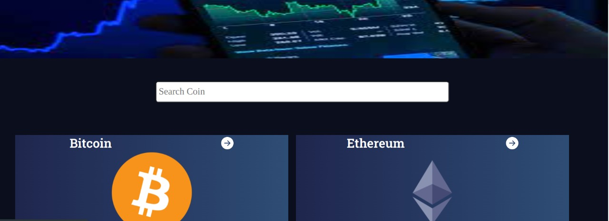

## Preview

# Crypto Market Data

> A website that provides accurate data about various crypto currencies

## Built With

- React
- Jest
- Redux
- JavaScript

## Live Demo
[Live Demo](m-trading-app.netlify.app)

## Live Presentation 

[Live presentation Link](https://www.loom.com/share/8952f4813c124b4586e6722b01568fc4)

## Getting Started

    git clone https://github.com/tingamapuro04/cryptocurrency.git
    cd cryptocurrencies
    npm install
    npm start
    

To get a local copy up and running follow these simple example steps.

### Prerequisites
You need to install node js

## Authors

👤 **Alphonce Mobutu**

- GitHub: [@tingamapuro04](https://github.com/tingamapuro04)
- LinkedIn: [@adoyo-alphonce](https://www.linkedin.com/in/adoyo-alphonce/)

## 🤝 Contributing

Contributions, issues, and feature requests are welcome!

Feel free to check the [issues page](../../issues/).

## 🤝 Acknowledge

 Nelson Sakwa on Behance.

## Show your support

Give a ⭐️ if you like this project!

## 📝 License

This project is [MIT](./MIT.md) licensed.
